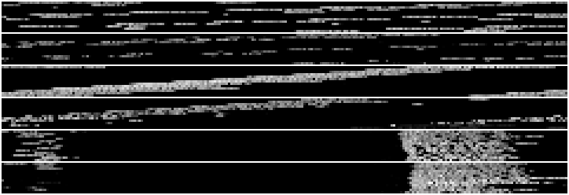

g# Circadian Data

Circadian data from http://www.circadian.org/data.html

## Data

### gerbil ####

This data set contains a single file (gerbil.hp).

The file contains heat production data (in watts) for a 113 g male fat-tailed gerbil (Pachyuromys duprasi) maintained at an environmental temperature of 24°C for 6 consecutive days. Lights were on daily from 1200 to 2400 h (files start at 0000 h).

Data resolution is 6 min. (Thus, the file contains 1,440 data points.)

### goat ###

This data set contains 6 files (goat1.ure, goat2.ure, ..., goat6.ure). 

The files contain data on blood concentration of urea (in mmol/l) for individual goats (Capra hircus) maintained at an environmental temperature of 19°C for 10 consecutive days. Lights were on daily from 0800 to 2000 h; feed was presented at 0800 h (files start at 0800 h). 

Data resolution is 3 h. (Thus, each file contains 80 data points.)

### hamster ###

This data set contains 6 files (hamster1.whl through hamster6.whl). 

The files contain running-wheel activity data for 2-month-old golden hamsters (Mesocricetus auratus) maintained in constant darkness at 24°C for 13 days. Files hamster1.whl and hamster2.whl refer to homozygous tau-mutant hamsters, files hamster3.whl and hamster4.whl to heterozygous tau-mutant hamsters, and files hamster5.whl and hamster6.whl to wild-type hamsters. 

Data resolution is 6 min. (Thus, each file contains 3,120 data points.)

### horse ###

This data set contains 5 files (horse1.tb, horse2.tb, ..., horse5.tb). 

The files contain body temperature data (measured 15 cm into the rectum, in °C) for individual Thoroughbred female horses (Equus caballus) maintained at an environmental temperature of 13°C for 10 consecutive days. Lights were on daily from 0800 to 1700 h (files start at 0800 h). 

Data resolution is 2 h. (Thus, each file contains 120 data points.)

### human ###

This data set contains 3 files (SBP.txt, DBP.txt, and HR.txt). 

The files contain data for systolic blood pressure (mm Hg), diastolic blood pressure (mm Hg), and heart rate (beats per minute) of a sedentary 47-year-old male (Homo sapiens) living a normal life for 7 consecutive days. All files start at midnight. The subject's average sleep time was 3:00 AM, and his average wake time was 10:30 AM. 

Data resolution is 30 min. (Thus, each file contains 336 data points.)

### nile ###

This data set contains 10 files (nile1.whl through nile10.whl).

The files contain running-wheel activity data for ten 4-month-old Nile grass rats (Arvicanthis niloticus) maintained in constant darkness at 24°C for 16 days and under a light-dark cycle for 23 days. Under the light-dark cycle, lights were on daily from 0800 to 2000 h (all files start at 0000 h).

Data resolution is 6 min. (Thus, each file contains 9,360 data points.)

### pill ###

This data set contains 3 files (bug1.act, bug2.act, and bug3.act).

The files contain locomotor activity data (crossings of an infrared beam) for individual pill bugs (Armadillidium vulgare) maintained at an environmental temperature of 24°C for 15 consecutive days. Lights were on daily from 0800 to 2000 h (files start at 0000 h).

Data resolution is 6 min. (Thus, each file contains 3,600 data points.)

### rat ###

This data set contains 6 files (rat1.tb, rat1.hp, rat1.hl, rat2.tb, rat2.hp, rat2.hl).

The files contain data on the body temperature (in °C), metabolic heat production (in W), and dry heat loss (in W) of two rats (Rattus norvegicus) maintained in constant darkness at 24°C for 4 days. 

Data resolution is 6 min. (Thus, each file contains 960 data points.)

### tupaia ###

This data set ontains 4 files (tupaia14.prn, tupaia20.prn, tupaia26.prn, and tupaia32.prn).

The files contain body temperature data (in °C) for a 173 g male tree shrew (Tupaia belangeri) maintained at an environmental temperature of 14, 20, 26, and 32°C, respectively. Each file corresponds to 4 consecutive days. Lights were on daily from 1200 to 2400 h (files start at 0000 h). 

Data resolution is 6 min. (Thus, each file contains 960 data points.)

# License

The data files available here constitute a very small fraction of the data collected in the laboratory over the years. Use of data downloaded from this repository will not constitute copyright infringement as long as the source (http://www.circadian.org/data.html) is explicitly acknowledged. 
